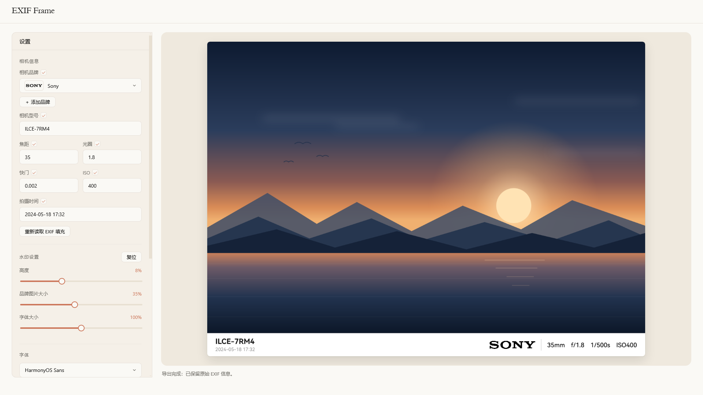

# EXIF Frame

给照片加上带 EXIF 信息的白边或模糊边框，实时预览，批量导出。

上传一张照片，自动读出相机品牌 / 型号 / 焦距 / 光圈 / 快门 / ISO / 拍摄时间，套上模板实时渲染，导出时**原样保留 EXIF**。



---

## 功能

**EXIF 自动填充** — 用 [exifr](https://github.com/MikeKovarik/exifr) 解析，读出 `Make` / `Model` / `FocalLength` / `FNumber` / `ExposureTime` / `ISO` / `DateTimeOriginal` 填入对应字段。品牌由 `Make` 映射（含 DJI 的机身特判）。填完后每一项都能手动改，也可以关掉不显示。

<!-- 可选：录一段「拖入照片 → 自动填充 → 实时渲染」的动图，存成 docs/demo.gif
     再删掉这三行注释（GIF 体积控制在 3MB 以内，否则 README 加载会明显变慢）。

-->

**两种模板**

|      | 经典                             | 模糊                           |
| ---- | ------------------------------ | ---------------------------- |
| 版面   | 照片下方一条白底边框                     | 照片四周留边，背景是原图放大高斯模糊 + 压暗      |
| 内容   | 左侧型号 / 拍摄时间，右侧品牌 + 参数，中间一道竖线分隔 | 第一行品牌图标 + 型号，第二行参数，整行居中      |
| 专属设置 | —                              | 图标颜色（全白 / 原色）                |
| 成片示意 |    |  |

> **样张说明**：表中示意图由脚本按两个模板的实际排版公式渲染，其中的照片是程序生成的示意风景（无边框原图：[`docs/demo-photo.png`](docs/demo-photo.png)），**非真实照片，仅作演示**。

**三个滑块** — 高度（水印区占照片高度，4–16%，默认 8%）、品牌图片大小（15–60%，默认 35%）、字体大小（50–150%，默认 100%）。改变任一滑块都会重新做一次溢出测量，必要时整体等比收缩，保证内容永远不溢出边框。

**品牌 Logo** — 内置 9 个 SVG（Canon / Casio / DJI / Fujifilm / Hasselblad / Leica / Nikon / Panasonic / Sony），也可以「＋ 添加品牌」上传自己的 SVG / PNG / WebP，存进 localStorage 长期保留。品牌是图标时绘制在边框上，缺图标则退回品牌名文字。

**字体** — 联网状态下由本地服务枚举本机已安装字体（含中文名，支持 `.ttc` 字体集合）；直开页面时退回浏览器字体探测。也可以「＋ 添加字体」自己传 TTF / OTF / TTC / WOFF / WOFF2。

**导出** — JPG（质量 0.92）或 PNG。单张导出 `<原名>_frame.jpg`；「批量导出文件夹」选一个目录，逐张套用当前设置，打包成 `watermark_batch_<时间戳>.zip`。

**EXIF 保留** — 源是 JPEG 时用 [piexif](https://github.com/hMatoba/piexifjs) 原样写回整段 EXIF；PNG 走自写的 `eXIf` chunk 写入；源文件本身没 EXIF 时写入最小可用集。同时会把水印里显示的品牌和型号写回 `Make` / `Model`，这样导出图在相册里也能被识别出机身。

---

## 快速开始

需要 **Node.js ≥ 18**。

```bash
npm install
npm start
```

然后打开 <http://localhost:3000>。换端口：`set PORT=3001 && npm start`（Windows）。

### 两种运行方式

本项目**不依赖服务器也能用**，两种模式的差别只在字体和 Logo 的来源：

|         | `npm start`（完整模式）                 | 直接双击 `public/index.html`（离线模式）          |
| ------- | --------------------------------- | --------------------------------------- |
| 打开方式    | <http://localhost:3000>           | `file://` 协议                            |
| 本机字体    | 服务器解析字体文件，**全部字体可用**（含中文名）        | 浏览器只能探测常见字体，列表较短                        |
| 品牌 Logo | 服务器用 sharp 把 SVG 光栅化成 PNG，任意尺寸都清晰 | 用 `vendor/brands-data.js` 里内嵌的 base64 图 |
| 其余功能    | 完全一致                              | 完全一致                                    |

离线模式是为「不想装 Node / 不想开服务」的场景准备的：把 `public/` 整个目录拷走就能跑，图片不会上传到任何地方，处理全在浏览器本地完成。

---

## 目录结构

```
EXIF_Frame/
├── server.js                 # Express 服务：静态托管 + 字体枚举 + Logo 光栅化
├── package.json
├── camera_brand_logo/        # 内置品牌 SVG（9 个）
└── public/
    ├── index.html            # 界面结构
    ├── styles.css            # 样式
    ├── app.js                # 全部前端逻辑：解析 / 排版 / 渲染 / 导出
    └── vendor/
        ├── exifr.min.js      # EXIF 解析
        ├── piexif.min.js     # EXIF 写回
        ├── jszip.min.js      # 批量导出打包
        └── brands-data.js    # 内置 Logo 的 base64 内嵌（离线模式用）
```

`app.js` 里两个模板的排版各有一段 `measure*` 函数（`measureA` / `measureB`）。它们被**测量和绘制共用**：先量出所有尺寸并返回，绘制段只读这些值，不再自己算一遍。改排版时只要动 `measure*` 一处，预览和导出就不会走样。

---

## 服务端接口

`server.js` 一共四个端点，都是给前端调的：

| 方法   | 路径               | 说明                                                                  |
| ---- | ---------------- | ------------------------------------------------------------------- |
| GET  | `/api/brands`    | 扫描 `camera_brand_logo/*.svg`，返回 `[{file, name}]`                    |
| GET  | `/logo/:file?h=` | 用 sharp 把 SVG 光栅化成 PNG，`h` 为目标高度（默认 512，上限 2048），结果在内存里按 `文件:高度` 缓存 |
| GET  | `/api/fonts`     | 解析本机字体文件，返回 `{fonts:[{family, zh, aliases}]}`                       |
| POST | `/api/shutdown`  | 关闭服务                                                                |

其余路径走静态托管，`/` 指向 `public/index.html`。

字体枚举是直接读字体二进制（`head` / `name` 表，UTF-16BE 解码），不走第三方库；`.ttc` 字体集合会逐个解析。**字体名取 `nameID 1`（Family）而不是 `nameID 16`**，因为 Word / PS 会把 "Segoe UI Light" 这类字重变体当成独立条目，用 16 会导致列表里出现一堆字重名。

---

## 自定义数据的存放位置

浏览器 localStorage，两个 key：

- `exifframe_custom_brands` — 自定义品牌的名称 + 图片
- `exifframe_custom_fonts` — 自定义字体

字体文件体积大，超出 localStorage 配额时会写入失败，此时该字体**只在当次会话有效**（代码里有 try/catch，不会报错打断）。清空浏览器数据会一并清掉这两项。

---

## 已知限制

- 批量导出是**串行**逐张处理，几百张的大目录会比较慢（每张都要重绘一次完整画布）。
- 批量导出的文件名固定为 `<原名>_frame.<ext>`，同名会互相覆盖（JSZip 后写入的覆盖先写入的）。
- 离线模式下浏览器能探测到的字体有限，想要完整字体列表请用 `npm start`。
- `sharp` 在 `npm install` 时会下载对应平台的预编译二进制，**首次安装需要联网**。
- 部分 HEIC 文件依赖浏览器自身的解码能力，能不能打开取决于浏览器。

---

## 技术栈

- **前端**：原生 JS + Canvas 2D，无框架、无构建步骤，改完刷新即可
- **服务端**：[Express](https://expressjs.com/) 4 + [sharp](https://sharp.pixelplumbing.com/)（仅用于 SVG → PNG 光栅化）
- **前端依赖**：exifr / piexifjs / JSZip，均已 vendor 到 `public/vendor/`，不经过 npm
